> 📚 Part of the [Cloud Native & DevOps Expertise](/articles/cloud-native-devops-expertise) series

## GitOps Multi-Tenant Architecture Overview

```mermaid
graph LR
    subgraph "Developer Experience"
        DEV[👨‍💻 Developer]
    end

    subgraph "Git Repositories"
        GIT1[📁 tenant-configs]
        GIT2[📦 helm-charts]
        GIT3[⚙️ argocd-apps]
    end

    subgraph "ArgoCD Control Plane"
        ARGO[🔄 ArgoCD<br/>ApplicationSet]
        SYNC[🔁 Auto Sync]
    end

    subgraph "Kubernetes Cluster"
        NS1[📦 Namespace: team-analytics<br/>Dagster + PostgreSQL]
        NS2[📦 Namespace: team-ml<br/>Dagster + PostgreSQL]
        NS3[📦 Namespace: team-data<br/>Dagster + PostgreSQL]
    end

    DEV -->|git push| GIT1
    GIT1 -->|watches| ARGO
    GIT2 -->|references| ARGO
    GIT3 -->|defines| ARGO

    ARGO -->|generates| SYNC
    SYNC -->|deploys| NS1
    SYNC -->|deploys| NS2
    SYNC -->|deploys| NS3

```



**Architecture GitOps Multi-Tenant:** 1 git push → ArgoCD détecte → Déploie automatiquement 3 tenants isolés en 5 minutes

## GitOps : Au-Delà du Buzzword

GitOps n'est pas qu'un terme à la mode. C'est une méthodologie révolutionnaire qui transforme la façon dont nous gérons l'infrastructure et les déploiements.

### Définition GitOps

1. **Git comme source de vérité**
2. **Déploiement déclaratif**
3. **Synchronisation automatique**
4. **Traçabilité complète**

## Le Défi : Déploiements Multi-Tenant

Comment déployer et gérer plusieurs environnements de données (tenants) avec :
- Isolation complète
- Configuration dynamique
- Zéro intervention manuelle
- Sécurité renforcée

## Notre Architecture

### Structure des Repositories


**3 repositories découplés:**
1. **argocd-apps/** - ApplicationSets et Applications ArgoCD
2. **helm-charts/** - Charts Helm réutilisables
3. **tenant-configs/** - Configurations spécifiques par équipe

### ApplicationSet Multi-Tenant

```yaml
# argocd-apps/applicationset.yaml
apiVersion: argoproj.io/v1alpha1
kind: ApplicationSet
metadata:
  name: dagster-tenants
spec:
  generators:
    - git:
        repoURL: https://github.com/slamer59/tenant-configs
        revision: main
        directories:
          - path: '*'  # Un dossier = un tenant

  template:
    metadata:
      name: 'dagster-{{path.basename}}'
    spec:
      project: default
      source:
        repoURL: https://github.com/slamer59/helm-charts
        targetRevision: main
        path: dagster
        helm:
          valueFiles:
            - https://github.com/slamer59/tenant-configs/{{path.basename}}/values.yaml
      destination:
        server: https://kubernetes.default.svc
        namespace: 'dagster-{{path.basename}}'
      syncPolicy:
        automated:
          prune: true
          selfHeal: true
```

## Isolation Multi-Tenant

### Architecture d'Isolation


**3 niveaux d'isolation:**
1. **Namespace Kubernetes** - Isolation logique
2. **ResourceQuota** - Limites CPU/Memory par tenant
3. **NetworkPolicy** - Isolation réseau stricte

### Configuration Kubernetes

```yaml
# Namespace dédié
apiVersion: v1
kind: Namespace
metadata:
  name: dagster-team-analytics
  labels:
    tenant: team-analytics

---
# Resource Quotas
apiVersion: v1
kind: ResourceQuota
metadata:
  name: tenant-quota
  namespace: dagster-team-analytics
spec:
  hard:
    requests.cpu: "10"
    requests.memory: "40Gi"
    persistentvolumeclaims: "10"

---
# Network Policy (isolation stricte)
apiVersion: networking.k8s.io/v1
kind: NetworkPolicy
metadata:
  name: tenant-isolation
  namespace: dagster-team-analytics
spec:
  podSelector: {}
  policyTypes:
    - Ingress
    - Egress
  ingress:
    - from:
      - podSelector: {}  # Autoriser uniquement au sein du namespace
  egress:
    - to:
      - podSelector: {}
    - to:  # Autoriser accès PostgreSQL partagé
      - namespaceSelector:
          matchLabels:
            name: databases
```

## Workflow Développeur


**Steps détaillés:**

```bash
# 1. Créer un nouveau tenant
mkdir tenant-configs/team-sales
cp tenant-configs/_template/values.yaml tenant-configs/team-sales/

# 2. Personnaliser la configuration
vim tenant-configs/team-sales/values.yaml

# 3. Commit & Push
git add tenant-configs/team-sales/
git commit -m "Add team-sales tenant"
git push origin main

# 4. ArgoCD détecte automatiquement (< 30s)
# → Crée Application ArgoCD automatiquement
# → Déploie Dagster dans namespace dagster-team-sales
# → ~3min plus tard: tenant opérationnel ✅
```

## Métriques de Performance

### Avant l'Architecture GitOps

- Déploiement manuel : **2 heures**
- Provisioning tenant : Intervention humaine requise
- Taux de déploiement : 5-10 par semaine
- Rollback : Complexe, risqué

### Après l'Architecture GitOps

- Déploiement automatique : **5 minutes**
- Provisioning tenant : Zéro intervention
- Taux de déploiement : 50+ par jour
- Rollback : Simple, instantané (git revert)

**Statistiques Clés:**
- 5 tenants actifs
- 99.5% de déploiements réussis
- Temps moyen de rollback : 45 secondes

## Related Cloud Native Articles

- [Helm Chart Visualization Tool](/articles/helm-chart-visualization-tool) - Maîtriser les dépendances Helm
- [Edge Computing with Jetson Xavier](/articles/edge-computing-docker-jetson-xavier) - Optimisation Docker pour ARM64

## Technologies Clés

- **ArgoCD** : Synchronisation Git → Kubernetes
- **Helm** : Templating de charts
- **Kubernetes** : Orchestration
- **Mustache** : Templating dynamique
- **Git** : Source de vérité

## Lessons Learned

1. **Automatisation totale** : Moins de tâches manuelles = moins d'erreurs
2. **Isolation par défaut** : Sécurité intégrée, pas ajoutée après coup
3. **Configuration as Code** : Traçabilité et reproductibilité

## Conclusion

Cette architecture GitOps n'est pas qu'une solution technique. C'est une transformation culturelle : déployer devient un acte de configuration, pas d'intervention.

<ViewRepository url="https://github.com/slamer59/dagster-argocd-configuration" text="Voir le projet sur GitHub" />

---

**Explorez tous mes projets Cloud Native →** [Cloud Native & DevOps Hub](/articles/cloud-native-devops-expertise)
